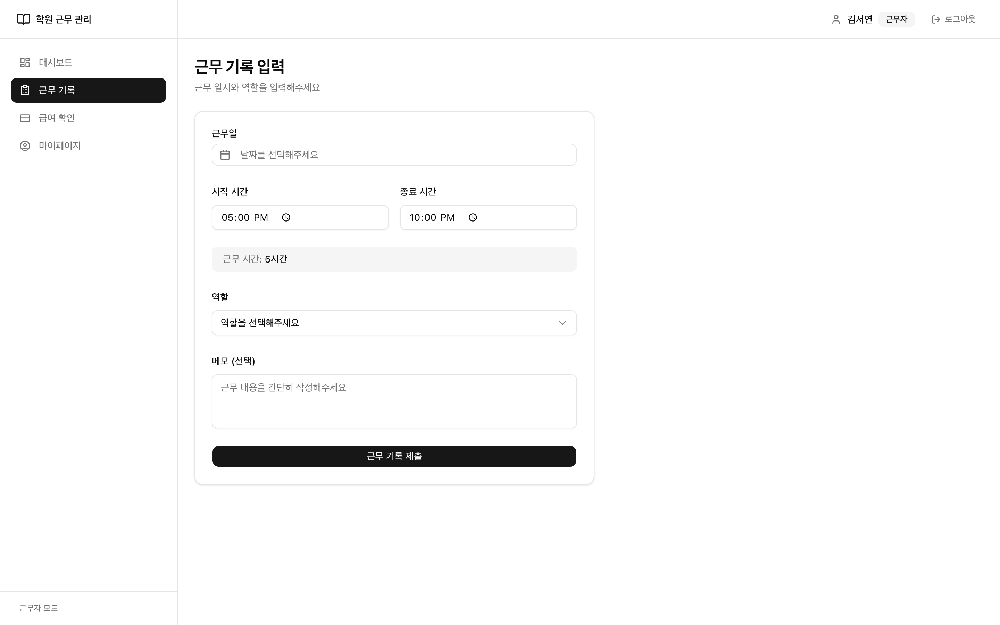
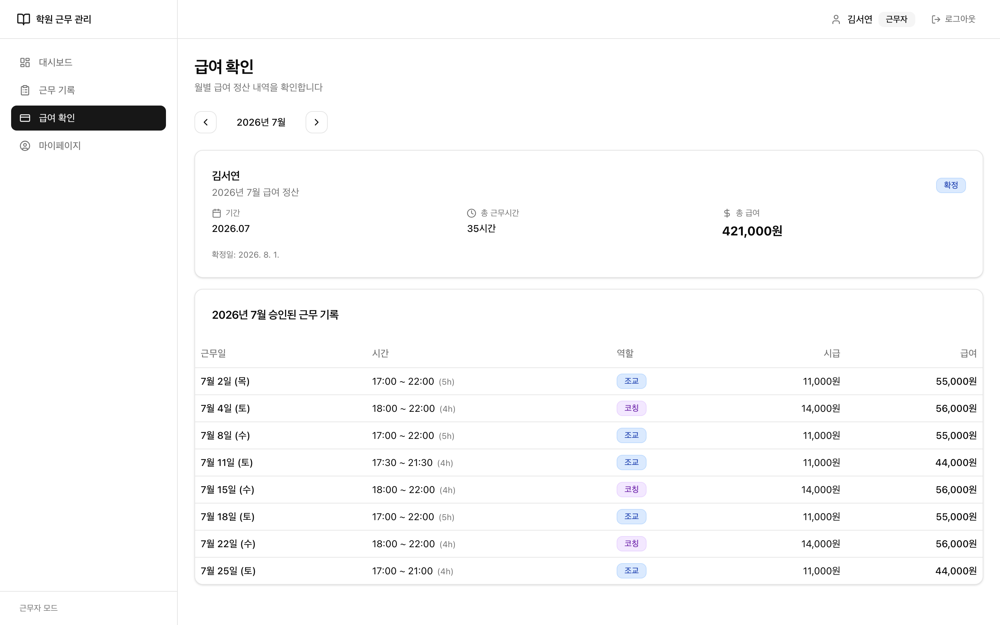
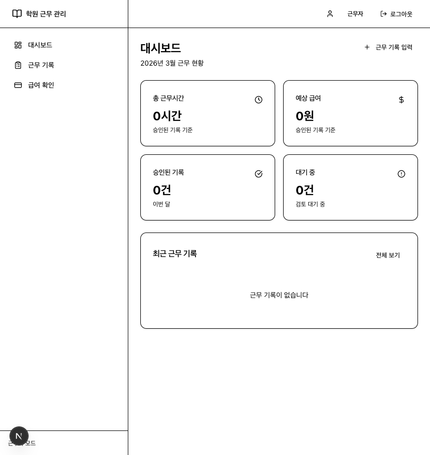
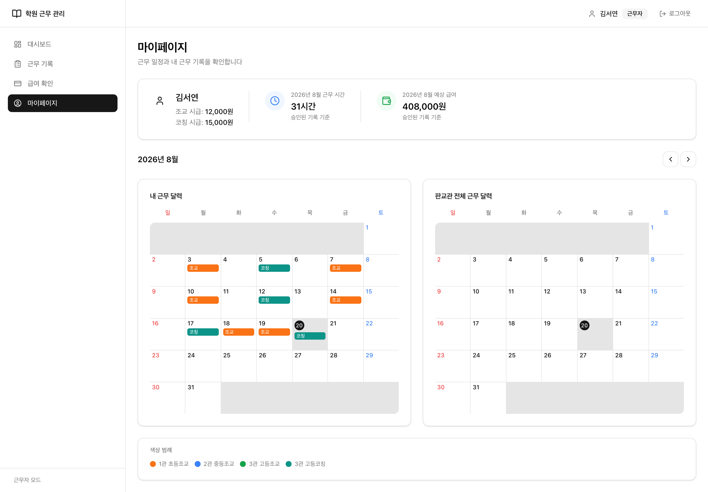

# academy-worklog-payroll

역할과 시점에 따라 시급이 달라지는 학원 근무자의 급여를, 과거 기록을 오염시키지 않고 정산하는 사내 웹 서비스.

---

## 왜 만들었나

실제로 근무 중인 학원의 급여 정산은 스프레드시트로 돌아간다. 근무자가 메신저로 근무 시간을 보고하면 관리자가 옮겨 적고, 역할별 시급을 곱한다.

문제는 시급이 바뀔 때 드러난다.

- 같은 근무자라도 **조교**와 **코칭**의 시급이 다르다.
- 시급 인상은 특정 날짜부터 적용된다. 그 이전 근무는 옛 시급으로 남아야 한다.
- 그런데 스프레드시트에서 시급 셀 하나를 고치면 **지난달 확정된 급여까지 조용히 바뀐다.** 정산이 끝난 뒤에 숫자가 달라지는데 아무도 모른다.

그래서 이 프로젝트가 푸는 문제는 하나다.

**시급이 바뀌어도, 이미 지나간 근무의 급여는 그대로여야 한다.**

## 기능

**근무자**

- 근무 기록 제출 (날짜·시작/종료 시간·역할·메모) — 제출 시점에 해당 날짜의 유효 시급이 자동 적용
- 반려된 기록 수정 후 재제출
- 월별 내 급여 조회 (근무 시간·적용 시급·금액 내역)
- Notion에 등록된 근무 일정을 캘린더로 확인 (Notion 토큰은 서버 라우트에서만 사용하고 클라이언트로 내려보내지 않는다)

**관리자**

- 제출된 근무 기록 승인 / 반려 (반려 시 사유 입력), 승인 취소
- 근무자 계정 생성, 퇴사자 비활성화
- 근무자별·역할별 시급 등록 및 이력 관리 (적용 시작일 기준)
- 월별 급여 집계 및 확정, CSV 다운로드

## 화면

| 근무 기록 제출                                              | 내 급여                                         |
| ----------------------------------------------------------- | ----------------------------------------------- |
|  |  |

| 근무자 대시보드                                    | 근무 일정 캘린더                                |
| -------------------------------------------------- | ----------------------------------------------- |
|  |  |

## 기술 스택

| 영역               | 사용 기술                                                     |
| ------------------ | ------------------------------------------------------------- |
| 프레임워크         | Next.js 16 (App Router, Server Actions) + TypeScript strict   |
| 백엔드 / DB / 인증 | Supabase (Auth, PostgreSQL, Row Level Security, plpgsql 함수) |
| UI                 | Tailwind CSS v3 + shadcn/ui                                   |
| 폼 / 검증          | React Hook Form + Zod                                         |
| 외부 연동          | Notion API (근무 일정)                                        |
| 배포               | Vercel                                                        |

## 핵심 설계 결정

### 1. 시급은 이력으로 쌓고, 근무 기록에는 스냅샷으로 박는다

`hourly_rates` 테이블은 **수정하지 않고 계속 쌓는(append-only) 구조**다. 시급을 바꾸면 기존 행을 UPDATE 하는 게 아니라 `effective_from`이 다른 행을 추가한다.

근무 기록을 제출하면 그 시점에 유효한 시급을 찾아 `work_logs.applied_hourly_rate`와 `calculated_pay`에 **값 자체를 복사해 저장**한다. 정규화 관점에서는 중복이지만 의도한 비정규화다. 조회할 때마다 시급 테이블을 join해서 계산하면, 시급 행이 하나라도 잘못 들어가는 순간 과거 급여가 전부 다시 계산된다. 급여는 "그때 얼마였는지"가 사실이어야 하는 데이터라, 계산 결과가 아니라 기록이어야 한다.

유효 시급 조회 (`src/lib/services/hourly-rate.ts`):

```
effective_from <= work_date
ORDER BY effective_from DESC, created_at DESC
LIMIT 1
```

`created_at` 2차 정렬이 있는 이유는, 같은 `effective_from`으로 시급을 두 번 등록하는 실수가 실제로 가능하기 때문이다. 이 경우 나중에 등록한 값을 적용한다. 조회 성능을 위해 `(worker_id, role_type, effective_from DESC)` 복합 인덱스를 걸었다.

### 2. 확정된 월은 앱과 DB 양쪽에서 막는다 — 한쪽만으로는 실패했다

권한과 무결성 검사를 서버 액션에만 두면 액션을 하나 빠뜨리는 순간 뚫린다. 그래서 Row Level Security로 DB에도 같은 규칙을 둔다.

- `is_admin()`을 `SECURITY DEFINER STABLE` 함수로 만들어 정책마다 반복되는 서브쿼리를 정리
- 상태 조건까지 정책에 포함 — 근무자는 자기 기록 중 `pending` 상태만 수정·삭제 가능
- 확정된 월(`finalized`)의 근무 기록은 트리거로 변경 자체를 차단
- 자가 가입 경로는 없다. 계정 생성은 서버 전용 service_role 키를 쓰는 관리자 액션에서만 가능하다

**이 구조를 한 번 무너뜨렸다가 되돌린 기록이 마이그레이션에 남아 있다.**

"승인된 기록도 수정할 수 있게 해달라"는 요구를 처리하면서, 막고 있던 트리거를 `007`에서 삭제하고 "앱 레이어에서 처리한다"는 주석을 남겼다. 그런데 앱 레이어의 확정 월 검사는 `createWorkLog`에만 있었고 `updateWorkLog`·`deleteWorkLog`에는 없었다. 두 레이어 모두 비어 있는 상태로 배포된 것이다.

여기에 더해, RLS는 여전히 `pending`만 허용하고 있었기 때문에 근무자가 반려된 기록을 삭제하면 0행이 매칭됐다. supabase는 이 경우 에러를 주지 않으므로 `if (error)` 검사를 통과하고 성공으로 처리됐다. **화면에는 삭제됐다고 뜨는데 DB에는 그대로 남는 침묵 실패**였다.

`010`에서 트리거를 복원하고, 도메인 규칙을 하나로 되돌렸다.

- `approved`·`rejected` 기록은 근무자가 수정·삭제할 수 없다. 수정이 필요하면 관리자가 승인을 취소해 `pending`으로 되돌린다. 승인된 기록을 제출자가 고칠 수 있으면 승인은 아무것도 보증하지 못한다.
- 확정된 월은 모든 경로에서 불변이다.
- 모든 update/delete는 `.select()`로 영향 행 수를 확인하고, 0행이면 실패로 처리한다.

### 3. 정산 확정은 Postgres 함수 하나로 원자화한다

기존 `finalizePayroll`은 ①대기 기록 검사 ②집계 upsert ③확정 상태 update, 세 개의 독립 쿼리였다. ①과 ③ 사이에 근무자가 기록을 제출하거나 다른 관리자가 승인하면, 확정된 금액과 실제 근무 기록이 어긋난 채로 확정된다. 금액을 바꾸는 연산에 트랜잭션 경계가 없었다.

supabase-js는 여러 문장을 하나의 트랜잭션으로 묶을 수 없다. 그래서 연산 전체를 Postgres 함수(`009`)로 내리고 앱에서는 `supabase.rpc("finalize_payroll", ...)` 한 번만 호출한다.

- 함수 본문은 단일 트랜잭션에서 실행된다.
- 요약 행을 `FOR UPDATE`로 잠가 같은 근무자·월에 대한 동시 확정을 직렬화한다.
- `SECURITY DEFINER`는 RLS를 우회하므로 관리자 권한 검사를 함수 안에서 직접 한다. 확정자 역시 인자로 받지 않고 `auth.uid()`에서 가져온다 — 호출자가 보낸 값을 신뢰하면 아래 하드닝 이력의 첫 번째 항목과 같은 종류의 취약점이 된다.
- 일괄 확정은 근무자별로 이 함수를 반복 호출한다. 한 명의 실패가 나머지를 막으면 안 되므로 전체를 한 트랜잭션으로 묶지 않고, 건너뛴 인원수를 함께 반환한다.

기간 계산이 SQL로 넘어가면서 부수적으로 버그 하나가 사라졌다. 일괄 확정이 `new Date(year, month, 0).toISOString()`으로 말일을 구하고 있었는데, KST에서 UTC로 변환되며 하루가 밀려 **말일의 대기 기록이 검사 범위에서 빠지고** 있었다.

## 하드닝 이력

초기 MVP는 로컬에서 한 번에 개발한 뒤 일괄 push했다. 그래서 첫 커밋 하나가 비정상적으로 크다. 그 이후의 보안·무결성 수정은 전부 브랜치와 PR로 남아 있고, 각 커밋 메시지에 문제 상황과 판단 근거를 적었다.

| 마이그레이션 | 내용                                                                                                                                                                              |
| ------------ | --------------------------------------------------------------------------------------------------------------------------------------------------------------------------------- |
| `008`        | 가입 트리거가 클라이언트가 보낸 `raw_user_meta_data.role`을 그대로 신뢰하고 있었다. `signUp` 호출 한 번으로 관리자 계정을 만들 수 있는 권한 상승 경로였다. 역할을 `worker`로 고정 |
| —            | `/api/notion/schedule`에 인증이 없어 비로그인 상태로 근무자 실명과 일정 전체가 조회됐다. 인증·권한 검사 추가                                                                      |
| `010`        | 확정 월 보호 트리거 복원, `approved`/`rejected` 수정 차단 복구, 중복 RLS 정책 제거, 0행 침묵 실패 차단                                                                            |
| `009`        | 정산 확정을 `finalize_payroll` 함수로 원자화                                                                                                                                      |

## 로컬 실행

```bash
git clone https://github.com/dlaekduddlaekdud/academy-worklog-payroll.git
cd academy-worklog-payroll
npm install

cp .env.example .env.local   # 값 채우기

npm run dev
```

Supabase 프로젝트를 만든 뒤 `supabase/migrations/` 아래 SQL을 **번호 순서대로**(001~010) 실행한다.

Supabase 대시보드에서 Authentication > Sign In / Providers를 열고
**Allow new users to sign up을 끈다.** 계정은 관리자만 만들 수 있어야 하는데,
이 설정이 켜져 있으면 앱에 가입 화면이 없어도 anon key로 `/auth/v1/signup`을
직접 호출해 계정을 만들 수 있다.

첫 관리자 계정은 화면에서 만들 수 없다. Authentication > Users에서 추가한 뒤
아래 쿼리로 승격한다. 이후 근무자 계정은 관리자 화면에서 만든다.

```sql
update profiles set role = 'admin' where email = 'your@email.com';
```

### 환경 변수

| 변수                            | 설명                                           |
| ------------------------------- | ---------------------------------------------- |
| `NEXT_PUBLIC_SUPABASE_URL`      | Supabase 프로젝트 URL                          |
| `NEXT_PUBLIC_SUPABASE_ANON_KEY` | Supabase anon key                              |
| `SUPABASE_SERVICE_ROLE_KEY`     | 관리자의 근무자 계정 생성에만 사용 (서버 전용) |
| `NOTION_TOKEN`                  | Notion 통합 토큰 (선택)                        |
| `NOTION_SCHEDULE_DB_ID`         | 근무 일정 Notion DB ID (선택)                  |

Notion 환경변수가 없으면 에러 대신 빈 배열을 반환해서, 연동 없이도 나머지 기능이 동작한다.

## 알려진 한계

포트폴리오용 MVP이며, 다음은 인지하고 남겨둔 부분이다.

- **자정을 넘기는 근무를 지원하지 않는다.** 근무 시간 검증이 `종료 > 시작`이라 22:00~02:00 입력이 불가능하다. 현재 학원 운영 시간이 자정 전에 끝나서 MVP 범위에서 제외했다. 날짜를 함께 다루는 구조로 바꿔야 한다.
- **반려 사유가 덮어쓰기된다.** 반려 → 재제출 → 재반려 시 이전 사유가 사라진다. 이력이 필요하면 별도 테이블로 분리해야 한다.
- **관리자 근무 기록 목록에 페이징이 없다.** 근무자·기간이 늘어나면 전체 로드가 문제가 된다.
- **자동화 테스트가 없다.** 급여 계산과 월 경계 날짜 같은 순수 함수, 그리고 `finalize_payroll`의 동시 호출부터 도입할 예정이다.

## 프로젝트 구조

```
src/
├─ app/
│  ├─ (admin)/admin/       근무 기록 심사, 근무자·시급 관리, 급여 정산
│  ├─ (worker)/worker/     근무 기록 제출, 내 급여, 마이페이지
│  └─ api/                 Notion 일정 프록시, 급여 CSV
├─ components/             admin / worker / common / ui
├─ lib/
│  ├─ services/            시급 조회, 급여 집계, Notion
│  ├─ utils/               급여 계산, CSV 생성
│  ├─ validations/         Zod 스키마
│  └─ supabase/            client / server / middleware
└─ types/

supabase/migrations/       001~010 스키마, RLS 정책, 무결성 트리거, 정산 함수
```

설계 과정과 단계별 작업 내역은 [ROADMAP.md](./ROADMAP.md)에 있다.
